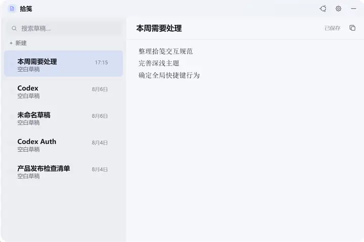
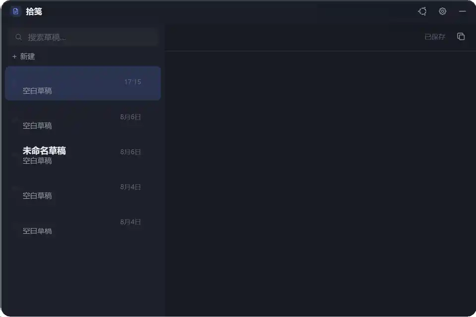

# 拾笺 Shijian

> 一个轻量、快速、本地优先的 Windows TXT 草稿应用。

[English](./README.en.md)

拾笺用于记录随手想法、临时文本、代码片段和待办草稿。它直接读写本地 `.txt` 文件，不依赖账号、云端数据库或专有格式，目标是做到打开快、记录快、退出后文件仍然完全属于你。

当前版本基于 **Tauri 2 + Rust + Vanilla JavaScript/CSS**，优先支持 Windows。

## 特性

- **本地优先**：草稿直接保存为 UTF-8 `.txt` 文件。
- **快速呼出**：支持全局快捷键和系统托盘。
- **自动保存**：编辑时自动写入本地文件。
- **外部修改感知**：监听草稿目录变化，方便与其他编辑器配合。
- **回收站删除**：删除草稿时进入系统回收站，而不是直接永久删除。
- **深色 / 浅色主题**：同时支持透明玻璃模式。
- **智能左右预览**：靠近屏幕边缘时自动调整预览方向。
- **多 DPI / 双显示器适配**：窗口裁剪与坐标处理针对 Windows 做了专门适配。
- **无前端框架**：前端直接由 HTML、CSS 和 JavaScript 驱动，结构简单。

## 截图

<table>
<tr>
<td></td>
<td></td>
</tr>
<tr>
<td align="center">浅色模式</td>
<td align="center">深色模式</td>
</tr>
</table>

> 图片来自实际运行界面；已清理本地草稿标题、正文等可能包含个人信息的内容。

## 安装

### 下载发行版

首个公开版本发布后，可从 GitHub Releases 下载 Windows 安装包。

### 从源码构建

需要：

- Windows 10 / 11
- Node.js 18+
- Rust stable
- Tauri 2 所需的 Windows 构建环境

```bash
git clone https://github.com/Zero-X-5/desktop-drafts-ui.git
cd desktop-drafts-ui
npm install
npm run tauri build
```

开发运行：

```bash
npm run tauri dev
```

## 默认快捷键

| 快捷键 | 作用 |
|---|---|
| `Ctrl + Shift + Space` | 显示 / 隐藏拾笺 |
| `Ctrl + Shift + N` | 新建草稿 |

快捷键可在应用设置中关闭。

## 数据与隐私

拾笺不要求登录，也不主动上传草稿内容。

草稿保存在你选择的本地目录中；首次运行默认使用系统 Documents 目录下的 `拾笺` 文件夹。设置保存在 Tauri 的应用配置目录中。

更多说明见 [PRIVACY.md](./PRIVACY.md)。

## 技术栈

- [Tauri 2](https://tauri.app/)
- Rust
- Vanilla JavaScript
- Vanilla CSS
- Windows API (`SetWindowRgn`) 用于 DPI 感知的原生圆角窗口裁剪

## 项目结构

```text
.
├── src/                  # 前端 HTML / CSS / JavaScript
├── src-tauri/            # Rust / Tauri 后端
├── docs/images/          # 项目展示图片
├── AGENTS.md             # 项目开发协议
├── CODEMAP.md            # 代码地图
├── DESIGN.md             # UI 设计规范
├── STATUS.md             # 当前开发状态
└── .github/              # Issue / PR / CI / Release 配置
```

## 开发原则

拾笺当前窗口架构已经经过 Windows 多 DPI、双显示器和连续交互验证。涉及窗口尺寸、Region、预览左右切换的修改，请先阅读 `AGENTS.md`、`STATUS.md`、`CODEMAP.md` 和 `DESIGN.md`。

核心约束：

- 单窗口、单 WebView、单 DOM。
- 原生窗口固定为 720×480。
- Windows 下通过原生 Region 切换可见区域。
- 不恢复运行时 `setSize` / `onResized` 的旧方案。

## 贡献

欢迎提交 Bug、功能建议和 Pull Request。

开始贡献前请阅读 [CONTRIBUTING.md](./CONTRIBUTING.md)。

## 路线图

当前优先级：

- [ ] 发布首个可下载的 Windows `v0.1.0`
- [x] 补充项目真实深色 / 浅色运行截图（已脱敏）
- [ ] 完善搜索与多草稿交互
- [ ] 增加自动化测试覆盖
- [ ] 根据真实用户反馈继续打磨交互

## 安全

如果发现安全问题，请不要直接公开敏感细节，处理方式见 [SECURITY.md](./SECURITY.md)。

## License

[MIT](./LICENSE)
